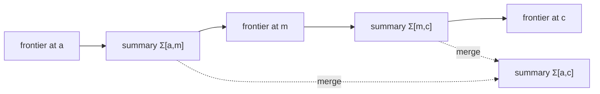

# HCP-DP

[](https://github.com/logannye/hcp-dp/actions/workflows/ci.yml)
[](Cargo.toml)
[](LICENSE)
[](https://github.com/logannye/hcp-dp/releases)

HCP-DP is a Rust dynamic-programming engine for **exact traceback without
storing full DP tables**, plus the `hcp-align` CLI for sequence alignment.

The project is built around height-compressed dynamic-programming summaries:
interval operators that compose like the original recurrence and still allow an
exact path to be reconstructed. The current alpha focuses its CLI on
biosequence-style alignment, where correctness can be checked against
independent baselines and the workflow is immediately useful. The Rust library
also includes dynamic time warping as an early proof that the contract is not
limited to sequence-alignment recurrences.

## What You Can Use Today

`hcp-align` supports:

- Levenshtein edit distance with deterministic `--engine auto` selection and an
  exact adaptive-banded traceback backend for low-edit-distance pairs.
- Levenshtein score-only mode with an exact arbitrary-length Myers bit-vector
  backend for fast distance queries that do not need traceback.
- Global Needleman-Wunsch alignment with linear gaps.
- Global Gotoh alignment with affine gaps.
- Smith-Waterman local alignment with linear gaps.
- Semi-global alignment of a full query against any target interval.
- Single-record inline input and pairwise multi-record FASTA/FASTQ batch input.
- Text, JSON, JSONL, TSV, and compact CIGAR-style output.
- Independent path scoring for every result, with optional full-table
  verification on bounded inputs.

This is an alpha release. The public surface is intentionally narrow: shipped
problems must pass the contract harness, and performance claims are limited to
the generated reports in this repository.

## Quickstart

Install the CLI from the repository:

```bash
cargo install --git https://github.com/logannye/hcp-dp --bin hcp-align
```

Or clone the repo and install locally:

```bash
git clone https://github.com/logannye/hcp-dp.git
cd hcp-dp
cargo install --path .
```

Run a verified edit-distance alignment:

```bash
hcp-align edit-distance \
  --query kitten \
  --target sitting \
  --verify \
  --format json
```

Representative output excerpt:

```json
{
  "schema_version": "hcp-align.v1",
  "engine": "hcp-dp",
  "mode": "edit-distance",
  "backend": "adaptive-banded",
  "distance": 3,
  "path_score": 3,
  "verification_status": "full",
  "cigar": "1X3=1X1=1I"
}
```

`edit-distance` defaults to `--engine auto`. Auto first tries a bounded exact
banded traceback and falls back to HCP linear-space traceback when the pair is
outside the auto band. For reproducible backend comparisons, choose an engine
explicitly:

```bash
hcp-align edit-distance \
  --engine adaptive-banded \
  --query ACGTACGT \
  --target ACGTTCGT \
  --verify \
  --format json
```

When only the distance is needed, `--score-only` uses the exact Myers
bit-vector backend and omits traceback, CIGAR, operations, and `path_score`:

```bash
hcp-align edit-distance \
  --score-only \
  --query kitten \
  --target sitting \
  --verify \
  --format json
```

Batch FASTA/FASTQ input uses pairwise zip mode: query record `i` is aligned to
target record `i`.

```bash
hcp-align edit-distance \
  --query-file reads.fa \
  --target-file references.fa \
  --verify \
  --format jsonl \
  --operation-detail none \
  --output results.jsonl
```

Prebuilt alpha binaries are available from
[GitHub Releases](https://github.com/logannye/hcp-dp/releases). Each release
artifact includes the `hcp-align` binary, README, license, and SHA-256 checksum.

## Why It Is Different

Classic DP traceback stores every cell:

```text
time  = Θ(TF)
space = Θ(TF)
```

where `T` is the number of layers and `F` is the frontier width.

HCP-DP treats an interval of layers as a composable summary:



The engine computes the final objective with summary operators, then
reconstructs an exact path by recursively selecting endpoint-constrained split
boundaries. The returned path is not trusted by convention: tests and CLI
verification score it independently.

For block height `b`, summary size `sigma`, and output path length `L`, the
generic checkpoint memory model is:

```text
HCP checkpoint space = Θ(T*sigma/b + bF + L)
```

For the shipped sequence problems, summaries are lightweight interval
descriptors. With `b = 1`, HCP-DP exposes a reusable linear-space exact traceback
regime:

```text
HCP linear-space traceback = Θ(T + F + L)
```

The broader strategy is to pair that exact-path contract with specialized
frontiers where structure permits better time complexity. Edit distance is the
first proof point:

| Engine | Exact path | Useful regime | Complexity |
|---|---:|---|---|
| `auto` | yes | default deterministic backend policy | bounded banded attempt, then HCP fallback |
| `hcp` | yes | generic summary-tree traceback | quadratic score work, sub-table memory |
| `hcp-linear` | yes | minimal retained checkpoint state | quadratic score work, linear retained state |
| `adaptive-banded` | yes | low edit distance `s` | roughly `O(n*s)`, worst-case quadratic |
| `myers` | no | score-only edit distance | `O(ceil(n/64) * m)` bit-vector scoring |
| `myers-u64` | no | patterns up to 64 symbols | bit-parallel exact distance |

In the generated local report, a 2048 bp near-match case with four edits ran in
about `0.009s` with exact adaptive-banded traceback, compared with about
`0.32s` for rolling-row score-only DP, `0.37s` for full-table score-only DP, and
about `1.0s` for generic HCP exact traceback. Run the report locally to measure
your machine:

```bash
cargo run --bin scale_probe -- \
  --mode edit-distance-deep \
  --engine adaptive-banded-path \
  --max-size 2048 \
  --format table
```

## Alignment Examples

Global Needleman-Wunsch:

```bash
hcp-align global-linear \
  --query GATTACA \
  --target GCATGCU \
  --match 1 \
  --mismatch-penalty 1 \
  --gap -1 \
  --verify \
  --format json
```

Affine-gap global alignment:

```bash
hcp-align global-affine \
  --query ACB \
  --target A \
  --match 2 \
  --mismatch-penalty 1 \
  --gap-open -3 \
  --gap-extend -1 \
  --verify \
  --format json
```

Smith-Waterman local alignment:

```bash
hcp-align local-linear \
  --query ACACACTA \
  --target AGCACACA \
  --match 2 \
  --mismatch-penalty 1 \
  --gap -2 \
  --verify \
  --format json
```

Semi-global alignment:

```bash
hcp-align semiglobal-linear \
  --query ACGT \
  --target TTACGTTT \
  --match 2 \
  --mismatch-penalty 1 \
  --gap -2 \
  --verify \
  --show-alignment \
  --format text
```

## Verification Model

Every `hcp-align` result includes:

- the reported score or distance,
- an independently computed `path_score` when a traceback is produced,
- half-open query and target coordinates,
- a CIGAR-like operation string using `=`, `X`, `D`, and `I` when traceback is
  produced,
- `verification_status`.

With `--verify`, `hcp-align` also runs a full-table baseline when the larger
input length is within `--verify-limit`:

```text
full       path score and full-table baseline matched
path_only  path score matched, full-table baseline was skipped
score_only exact score-only backend ran without traceback; full baseline was skipped
failed     path score or full-table baseline disagreed
```

The default `--verify-limit` is `2048`; use `--verify-limit 0` to remove the
limit.

## Rust Library

The crate exposes the summary-tree engine and correctness-tested problem
implementations:

- `HcpEngine`
- `HcpEngineBuilder`
- `HcpProblem`
- `SummaryApply`
- `alignment::AlignmentTrace`
- `problems::dtw::DtwProblem`
- `problems::edit_distance::EditDistanceProblem`
- `problems::lcs::LcsProblem`
- `problems::nw_align::NwProblem`
- `problems::nw_affine::NwAffineProblem`
- `problems::semiglobal::SemiGlobalProblem`
- `problems::smith_waterman::SmithWatermanProblem`

Example:

```rust
use hcp_dp::{problems::lcs::LcsProblem, HcpEngine};

let problem = LcsProblem::new(b"CCA", b"C");
let (cost, path) = HcpEngine::new(problem.clone()).run();

assert_eq!(cost, 1);
assert_eq!(problem.score_path(&path), Some(cost));
```

Use `HcpEngine::linear_space(problem)` when retained memory is the priority.

## Capability Matrix

| Problem | Exact objective | Exact path | CLI | External validation | Caveat |
|---|---:|---:|---:|---|---|
| LCS | yes | yes | no | no | Library-only in this alpha. |
| Needleman-Wunsch, linear gap | yes | yes | yes | Parasail optional | No SIMD runtime path. |
| Needleman-Wunsch, affine gap | yes | yes | yes | Parasail optional after gap calibration | Boundary state is explicit; slower than linear modes. |
| Smith-Waterman, linear gap | yes | yes | yes | Parasail optional | Returns selected local traceback only. |
| Edit distance, auto backend | yes | yes | yes | Edlib optional | Default; selects adaptive-banded traceback or HCP fallback. |
| Edit distance, HCP traceback | yes | yes | yes | Edlib optional | Generic exact traceback engine. |
| Edit distance, adaptive banded | yes | yes | yes | Edlib optional | Fastest when final edit distance is small. |
| Edit distance, Myers bit-vector | yes | no | yes, `edit-distance --score-only` | checked internally | Exact distance only; arbitrary pattern length. |
| Edit distance, Myers u64 | yes | no | report tool only | checked internally | Pattern length must be at most 64 symbols. |
| Semi-global, linear gap | yes | yes | yes | no external anchor yet | Full query against any target interval. |
| Dynamic time warping | yes | yes | no | no | Library/report proof point for non-sequence DP. |

See [docs/capabilities.md](docs/capabilities.md) for the full matrix.

## Documentation

- [CLI reference](docs/cli.md)
- [Technical design](docs/design.md)
- [Capability matrix](docs/capabilities.md)
- [Output schema reference](docs/output-schema.md)
- [Sample report](docs/sample-report.md)
- [Alpha release checklist](docs/alpha-release-checklist.md)

## Validation And Reports

Local checks:

```bash
cargo fmt --all -- --check
cargo clippy --workspace --all-targets -- -D warnings
cargo test --workspace
bash scripts/check.sh
```

Generate a correctness and performance report:

```bash
python3 scripts/perf_report.py --scenario edit_distance --verify-limit 128
```

The checked-in [sample report](docs/sample-report.md) is generated from a small
bounded run to show report structure. It is an example artifact, not a
performance claim for other machines:

```bash
python3 scripts/perf_report.py \
  --scenario edit_distance \
  --verify-limit 128 \
  --max-size 128 \
  --skip-external \
  --sample-output docs/sample-report.md
```

Run optional external validation against Parasail and Edlib when installed:

```bash
python3 scripts/validate_external.py
python3 scripts/validate_external.py --required
```

Generated reports are written under `target/hcp-dp-report/`. External validators
are not runtime dependencies.

## Current Limits

- Alpha APIs, CLI flags, and JSON fields may change before `1.0`.
- Batch mode is pairwise zip only; one-vs-many and all-vs-all are deferred.
- Wrapped FASTQ is not supported.
- SAM/BAM/PAF export is not implemented.
- Protein substitution matrices are not implemented; scoring is match/mismatch.
- No claim is made of broad superiority over specialized SIMD aligners.
- The crate is not published to crates.io yet.

## Adding A New Problem

A new public problem must satisfy the same contract harness as the shipped
modules:

- summary apply equals direct recurrence replay,
- summary merge equals the direct combined interval,
- split boundaries are feasible for both recursive halves,
- reconstructed segments join exactly,
- independent path scoring realizes the reported objective,
- full-table or external baselines agree where applicable.

If the proof is incomplete, keep the module private or behind an experimental
feature.

## License

MIT.
