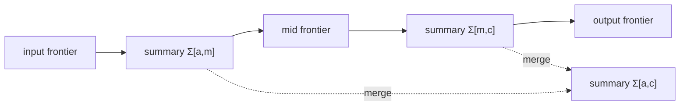

# HCP-DP

[](https://github.com/logannye/hcp-dp/actions/workflows/ci.yml)
[](Cargo.toml)
[](LICENSE)
[](https://github.com/logannye/hcp-dp/releases)

HCP-DP is a Rust engine and CLI for **exact sequence-alignment traceback from
composable height-compressed dynamic-programming summaries**.

The public product surface is `hcp-align`, an alpha command-line aligner for
biosequence-style workloads. The current flagship proof point is exact
Levenshtein edit-distance traceback, independently path-scored and compared
against full-table, linear-space, and optional Edlib baselines in reproducible
reports.

This is a correctness-first alpha. The project intentionally exposes only the
problems that pass the contract harness; speed and memory claims stay
conservative until they are backed by release artifacts.

## Try It

```bash
cargo install --path .

hcp-align edit-distance \
  --query kitten --target sitting \
  --verify --format json
```

Representative output excerpt:

```json
{
  "schema_version": "hcp-align.v1",
  "engine": "hcp-dp",
  "mode": "edit-distance",
  "distance": 3,
  "path_score": 3,
  "verification_status": "full",
  "cigar": "1X3=1X1=1I"
}
```

Batch FASTA/FASTQ input uses pairwise zip mode:

```bash
hcp-align edit-distance \
  --query-file reads.fa \
  --target-file references.fa \
  --verify \
  --format jsonl \
  --operation-detail none \
  --output results.jsonl
```

Full CLI reference: [docs/cli.md](docs/cli.md).

## Why It Is Different

Standard dynamic-programming traceback usually stores a full table or recomputes
large parts of it. HCP-DP instead treats each layer interval as a reusable
operator over frontier states:



The engine builds a summary tree, computes the final objective, and reconstructs
an exact path by recursively selecting endpoint-constrained split boundaries.
Every public problem must prove that its summaries compose correctly and that
the returned path realizes the reported score or distance.

## Current Public Surface

The crate currently exports:

- `alignment::AlignmentTrace`
- `HcpEngine`
- `HcpEngineBuilder`
- `HcpProblem`
- `SummaryApply`
- `problems::edit_distance::EditDistanceProblem`
- `problems::lcs::LcsProblem`
- `problems::nw_align::NwProblem`
- `problems::nw_affine::NwAffineProblem`
- `problems::semiglobal::SemiGlobalProblem`
- `problems::smith_waterman::SmithWatermanProblem`

The workspace also includes the `hcp-align` binary.

Former examples for banded LCS, Viterbi, DAG shortest path, and matrix-chain
multiplication were removed from the public surface. They should be reintroduced
only after passing the same contract harness.

## Capability Matrix

| Problem | Exact objective | Exact path | Summary laws | CLI | External score validation | Report coverage | Caveat |
|---|---|---|---|---|---|---|---|
| LCS | yes | yes | yes | no | no | `scale_probe` | Library-only in this alpha. |
| Needleman-Wunsch, linear gap | yes | yes | yes | yes | Parasail optional | `scale_probe`, report workflow | Parasail is validation only, not a runtime dependency. |
| Needleman-Wunsch, affine gap | yes | yes | yes | yes | Parasail optional after gap calibration | `scale_probe`, report workflow | Boundary state is explicit; slower than linear modes. |
| Smith-Waterman, linear gap | yes | yes | yes | yes | Parasail optional | `scale_probe`, report workflow | Returns the selected local traceback only. |
| Edit distance | yes | yes | yes | yes | Edlib optional | deep comparison report | Levenshtein distance only; flagship proof point. |
| Semi-global, linear gap | yes | yes | yes | yes | no external anchor yet | `scale_probe`, report workflow | Full query against any target interval. |

See [docs/capabilities.md](docs/capabilities.md) for the detailed matrix.

## Core Contract

An admissible problem implements `HcpProblem`:

```rust
pub trait HcpProblem {
    type State: Clone + PartialEq;
    type Frontier: Clone;
    type Summary: Clone + SummaryApply<Self::Frontier>;
    type Boundary: Clone + PartialEq;
    type Cost: Copy + Ord;

    fn num_layers(&self) -> usize;
    fn init_frontier(&self) -> Self::Frontier;
    fn forward_step(&self, layer: usize, frontier: &Self::Frontier) -> Self::Frontier;
    fn summarize_interval(&self, a: usize, b: usize) -> Self::Summary;
    fn merge_summary(&self, left: &Self::Summary, right: &Self::Summary) -> Self::Summary;
    fn initial_boundary(&self) -> Self::Boundary;
    fn terminal_boundary(&self, frontier_t: &Self::Frontier) -> Self::Boundary;
    fn choose_split(
        &self,
        a: usize,
        m: usize,
        c: usize,
        beta_a: &Self::Boundary,
        beta_c: &Self::Boundary,
        sigma_left: &Self::Summary,
        sigma_right: &Self::Summary,
    ) -> Self::Boundary;
    fn reconstruct_leaf(
        &self,
        a: usize,
        b: usize,
        beta_a: &Self::Boundary,
        beta_b: &Self::Boundary,
    ) -> Vec<Self::State>;
    fn extract_cost(&self, frontier_t: &Self::Frontier, beta_t: &Self::Boundary) -> Self::Cost;
}
```

The important rules:

- `summarize_interval(a, b)` must not depend on a particular input frontier.
- `SummaryApply::apply` must behave like replaying `forward_step` over that interval.
- `merge_summary(left, right)` must represent the adjacent union.
- `choose_split` must honor the requested start and end boundaries.
- `reconstruct_leaf` must return a segment that starts at `beta_a`, ends at
  `beta_b`, and realizes the local optimum.

## More Examples

```bash
hcp-align global-linear \
  --query GATTACA --target GCATGCU \
  --match 1 --mismatch-penalty 1 --gap -1 \
  --verify --format json
```

```bash
hcp-align global-affine \
  --query ACB --target A \
  --match 2 --mismatch-penalty 1 --gap-open -3 --gap-extend -1 \
  --verify --format json
```

```bash
hcp-align local-linear \
  --query ACACACTA --target AGCACACA \
  --match 2 --mismatch-penalty 1 --gap -2 \
  --verify --format json
```

```bash
hcp-align semiglobal-linear \
  --query ACGT --target TTACGTTT \
  --match 2 --mismatch-penalty 1 --gap -2 \
  --verify --show-alignment --format text
```

Library example:

```rust
use hcp_dp::{problems::lcs::LcsProblem, HcpEngine};

let problem = LcsProblem::new(b"CCA", b"C");
let (cost, path) = HcpEngine::new(problem.clone()).run();

assert_eq!(cost, 1);
assert_eq!(problem.score_path(&path), Some(cost));
```

## Verification And Reports

`hcp-align` always computes an independent path score from the returned path.
With `--verify`, it also runs a full-table baseline when the input is within
`--verify-limit`. Larger pairs still get path verification and report
`verification_status = "path_only"`.

Useful local checks:

| Purpose | Command |
|---|---|
| Full smoke check | `bash scripts/check.sh` |
| Unit and integration tests | `cargo test --workspace` |
| Strict docs | `RUSTDOCFLAGS="-D warnings" cargo doc --workspace --no-deps` |
| Scaling smoke probe | `cargo run --bin scale_probe -- --format table` |
| Edit-distance deep proof | `cargo run --bin scale_probe -- --mode edit-distance-deep --format json` |
| Optional external validation | `python3 scripts/validate_external.py` |
| Local report | `python3 scripts/perf_report.py` |
| Optional benchmarks | `RUN_BENCH=1 bash scripts/check.sh` |

Generated reports are written under `target/hcp-dp-report/`. External validation
against Parasail and Edlib is available as a manual GitHub Actions workflow and
is not part of default CI.

## Documentation

- [CLI reference](docs/cli.md)
- [Capability matrix](docs/capabilities.md)
- [Technical design](docs/design.md)
- [Output schema reference](docs/output-schema.md)
- [Alpha release checklist](docs/alpha-release-checklist.md)

## Release Status

GitHub alpha binaries are produced by the manual `Release Alpha` workflow. Each
artifact contains `hcp-align`, README, license, and a SHA-256 checksum. The repo
is not published to crates.io yet.

## Adding A New Problem

Use LCS or linear Needleman-Wunsch as the template.

Before exporting a new problem from `problems`, add tests that prove:

- summary apply equals direct replay,
- summary merge equals the direct combined interval,
- split boundaries are feasible,
- reconstructed segments join exactly,
- final path-realized cost equals the reported objective,
- known counterexamples remain fixed.

If any of these are missing, keep the module private or behind an experimental
feature.

## License

MIT.
