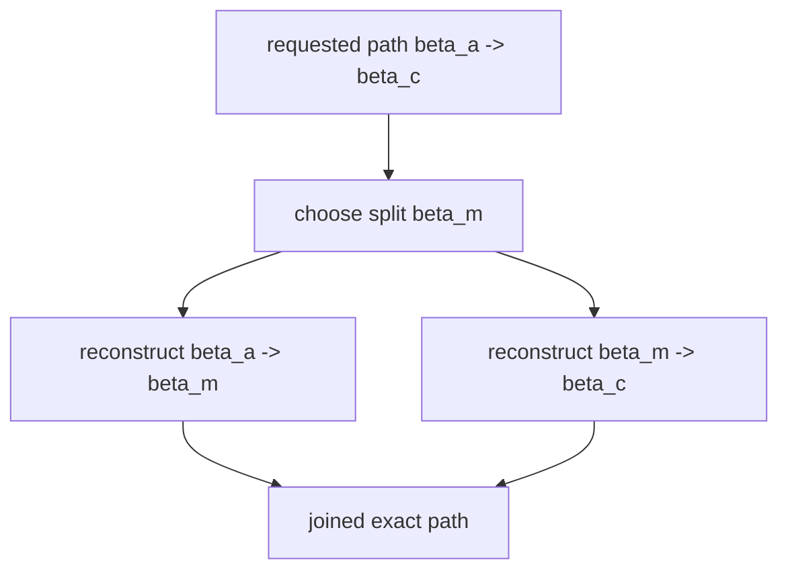

# Technical Design

HCP-DP is built around one technical claim: many layered dynamic-programming
problems can expose composable summaries for layer intervals, and those
summaries can be used to recover an exact traceback without storing the full DP
table.

The current alpha proves that claim on correctness-tested sequence-alignment
problems before expanding the public surface.

## Model

The engine views a DP as a sequence of layers. A frontier represents the state at
one layer boundary. A summary represents the effect of replaying an interval of
layers over any valid input frontier.

```text
frontier at a --summary(a,b)--> frontier at b
```

The key law is boundary independence:

```text
summary(a,b).apply(frontier) == replay_forward_steps(a,b, frontier)
```

Adjacent summaries must merge:

```text
merge(summary(a,b), summary(b,c)) == summary(a,c)
```

This lets the engine build a tree of interval summaries, compute the final
frontier, and recursively reconstruct a path through the tree.

## Reconstruction

Traceback is endpoint constrained. At every recursive split, the problem receives
the start boundary, end boundary, split layer, and both child summaries:

```text
choose_split(a, m, c, beta_a, beta_c, summary(a,m), summary(m,c))
```

The selected midpoint boundary must be feasible for both halves. Leaf
reconstruction then returns a segment that starts and ends at the requested
boundaries.



The returned path is not trusted by convention. Tests and CLI verification score
the path independently from the DP implementation.

## Why This Matters

Full-table DP makes traceback straightforward but stores every cell.
Linear-space methods such as Hirschberg reduce memory for specific recurrences
but are usually implemented problem by problem.

HCP-DP factors exact compressed traceback into a reusable contract:

- summaries describe interval behavior,
- summaries compose,
- reconstruction is constrained by explicit boundaries,
- each problem supplies only the logic needed for its recurrence.

The current alpha uses biosequence alignment because it offers clear correctness
baselines, independent external validators, and practical command-line
workflows.

## Efficiency Model

Let:

```text
T     = number of DP layers
F     = frontier width
b     = block height
sigma = retained size of one interval summary
L     = output path length
```

A full traceback table stores every DP cell:

```text
time  = Θ(TF)
space = Θ(TF)
```

The generic HCP checkpoint regime stores summaries and reconstructs through
bounded leaves:

```text
space = Θ(T*sigma/b + bF + L)
```

This is the central tuning knob. If summaries are frontier-sized, choosing
`b = sqrt(T*sigma/F)` yields `Θ(sqrt(TF*sigma) + L)` memory. If summaries are
lightweight interval descriptors, as in the current sequence implementations,
`sigma = O(1)` and `b = 1` gives:

```text
space = Θ(T + F + L)
```

That gives a reusable linear-space exact traceback mode. It is exposed by running
`HcpEngine::linear_space(problem)` or by comparing the `hcp-linear` engine in
`scale_probe --mode edit-distance-deep`.

## Specialized Frontier Backends

HCP by itself removes the need for a full traceback table. It does not magically
make every recurrence subquadratic. The route to broader SOTA efficiency is to
make the summary/frontier implementation specialized where the problem allows it:

- adaptive-banded edit distance: exact `O(n*s)`-style behavior when final edit
  distance `s` is small,
- Myers bit-vector edit distance: exact score-only distance using word
  parallelism across arbitrary pattern lengths,
- future wavefront affine alignment: exact gap-affine alignment in
  score-sensitive regimes,
- future sparse/layered DAG and Viterbi frontiers: avoid dense state tables when
  transitions are sparse.

The current code includes exact adaptive-banded edit-distance traceback and
arbitrary-length Myers exact distance scoring. The default HCP engines
demonstrate the reusable summary contract; the adaptive-banded traceback engine
demonstrates how specialized frontier algorithms can be made path-producing
instead of score-only. The edit-distance CLI's `auto` backend policy tries a
bounded exact banded traceback first and falls back to HCP linear-space
traceback when the optimum is outside that band. This split is deliberate:
reports can show where specialized frontier algorithms win today while
preserving the exact-path contract as the architecture to extend.

## Current Proof Points

- LCS
- global Needleman-Wunsch with linear gaps
- global Gotoh affine-gap alignment
- Smith-Waterman local alignment with linear gaps
- Levenshtein edit distance
- semi-global linear-gap alignment
- adaptive-banded exact edit-distance traceback
- Myers exact edit-distance scoring for arbitrary pattern lengths

Each exported problem is expected to pass contract tests for summary replay,
summary merge, split feasibility, path joining, independent path scoring, and
baseline agreement where applicable.

## Non-Goals For The Alpha

- Claiming broad superiority over specialized SIMD aligners.
- Exporting algorithms that do not pass the contract harness.
- Treating optional external validators as runtime dependencies.
- Supporting every sequence-file format or batch mode.
- Publishing to crates.io before the public surface settles.

## Reading The Code

Start with:

- `src/traits.rs` for the problem contract,
- `src/engine.rs` for summary-tree execution and reconstruction,
- `src/problems/edit_distance.rs` for the flagship proof point,
- `src/alignment.rs` for path-to-alignment formatting,
- `src/bin/hcp_align.rs` for the user-facing CLI.
